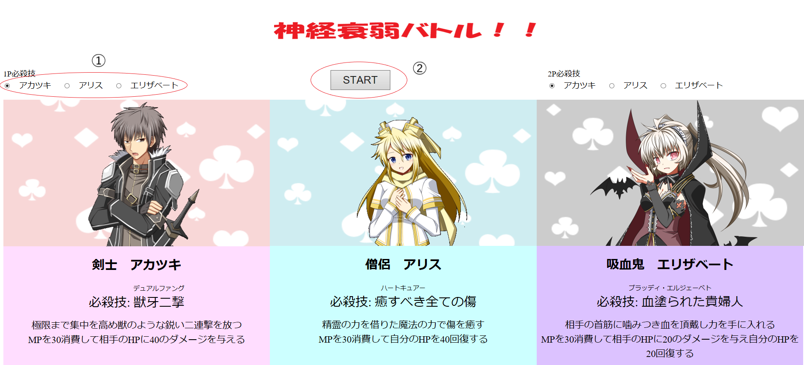
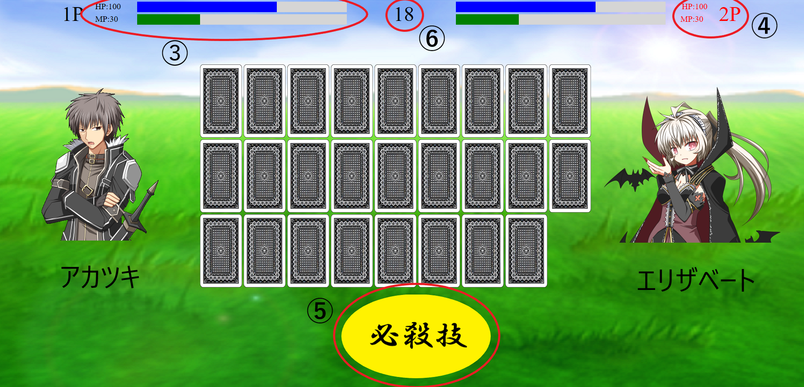

# 神経衰弱バトル！！
---
## 準備
---
- Clone or download をクリック，Download ZIP を選択してファイルをダウンロード．
- ダウンロードしたファイルを解凍，ファイルの中身の配置は変更しないこと．

## プレイの流れ
---
### ゲーム開始前

①キャラ選択ボタン
②STARTボタン
- start.htmlを実行してゲーム開始画面を開く（Chrome以外のブラウザを使用）
- 各プレイヤーがキャラ選択ボタンでキャラクターを選択
- STARTボタンをクリックするとゲーム開始
---
### ゲーム開始後

③HP・MPバー
④プレイヤー（赤色表示のプレイヤーがカードを選択できる）  
⑤必殺技ボタン
⑥制限時間

- 画面上部に各プレイヤーのHP・MPが表示される．カードを選択できるプレイヤーは赤色で表示される．
- カードをクリックするとカードをめくることが出来る．
- カードを2枚選択し，一致していれば相手のHPを減らし，自分のMPを増やす．ターンは継続される．
  - 1~3のカードを揃えたとき20，それ以外のカードを揃えたとき10のダメージを与える．
  - 揃えたカードの数字分自分のMPが回復する．
- カードが一致していない，または制限時間を過ぎるとターンが相手に移る．
- MPが30以上のとき，画面下部の必殺技ボタンをクリックすると選択したキャラクター固有の必殺技が発動する．
- 相手のHPをゼロにする，もしくはカードをすべてめくったときに自分のHPが相手のHPより多ければ勝利する．
